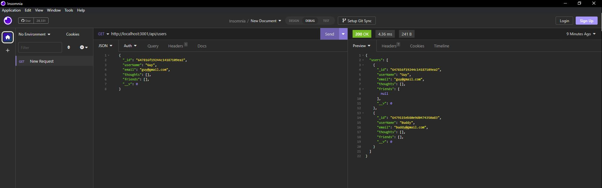

# Socialite Media

## Summary

Attempted to make a social media back-end allowing users to post/edit/delete thoughts, post/edit/delete reactions to thoughts, and to add/delete other users as friends. As of 6/1/2023, project is incomplete. Part-time coding bootcamp is part-time in attendance hours only.

## Credit

Just wanted to give my friend, Brandon, a shout out yet again for helping me with some of this project. Also, thanks to the two random StackOverflow posts I found whose URLs are buried too deep within my browser history for me to find.

